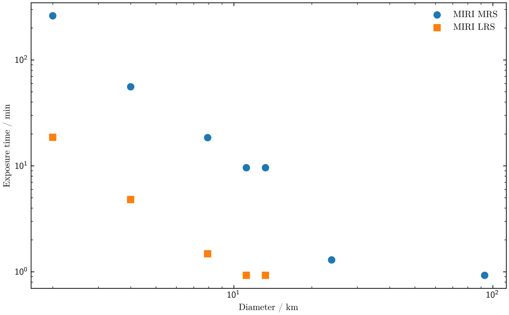

.. _miri-mrs-example:

MIRI Observations of Vesta Family
=================================

This tutorial outlines the observation planning for *Vesta* family members
using the MIRI instrument during JWST Cycle 6. Our main objective is to study
silicate composition, which requires achieving a target Signal-to-Noise Ratio
(SNR) of 300 around 10μm. As the 10μm feature is accessible with both MIRI Low
Resolution Spectrometer (LRS) and Medium Resolution Spectrometer (MRS), we
use both modes.

We place the following constraints:

· Targets must be Vesta family members with a known diameter.

· The sample must span a range of diameters to encompass different sizes.

· Required SNR is 300 around 10μm.

Identifying potential targets
------------------------------

We start by identifying all *Vesta* family members that have a known diameter, a
prerequisite for accurately modelling their thermal emission. We use the ``rocks``
package to access the SsODNet/BFT asteroid database.

.. code-block:: python

   import rocks

   # Load table of asteroid properties (SsODNet/BFT)
   bft = rocks.load_bft()

   # Select candidate targets: Vesta family members with known diameter
   is_vestoid = bft["family.family_name"] == "Vesta"
   has_diameter = bft["diameter.value"].notnull()

   vestoids = bft[is_vestoid & has_diameter]

This initial selection yields 2041 Vesta family members with known diameters at
the time of writing, all of which are potential targets.

Defining MIRI configurations
----------------------------

We configure the MIRI MRS and LRS modes using ``jayrock``, setting the optics,
exposure times, and readout patterns for each.

MIRI MRS
^^^^^^^^

For the MRS, we set a standard 4-point dither (``nexp=4``). To target the 10μm
silicate feature, we initially set the aperture to Channel 2 and the Long
disperser.

.. code-block:: python

   import jayrock

   miri_mrs = jayrock.Instrument('MIRI', mode='MRS')

   miri_mrs.detector.nexp = 4  # 4-pt dither
   miri_mrs.detector.readout_pattern = 'fastr1'  # recommended for MRS

   miri_mrs.aperture = "ch2"
   miri_mrs.disperser = "long"

MIRI LRS
^^^^^^^^

We configure the LRS for SLIT mode and specify a 2-point dither (``nexp=2``). Since
LRS has only one valid optical component, no further configuration is required.

.. code-block:: python

   miri_lrs = jayrock.Instrument('MIRI', mode='LRSSLIT')

   miri_lrs.detector.nexp = 2  # 2-pt dither
   miri_lrs.detector.readout_pattern = 'fastr1'  # recommended for LRS

Determining observable diameter range and exposure times
--------------------------------------------------------

To understand the diameter range achievable with each MIRI mode, we select the
largest Vesta family member within a set of representative diameter bins.

.. code-block:: python

    import pandas as pd

    # ------
    # Get largest Vestoid within diameter range
    diameter_bins = [1, 2, 4, 8, 12, 16, 24, 32, 48, 64, 96, 128, 256, 512, 1024]

    vestoids["diameter_bin"] = pd.cut(
        vestoids["diameter.value"], bins=diameter_bins, right=True, include_lowest=True
    )

    vestoids_largest_per_diameter_bin = vestoids.loc[
        vestoids.groupby("diameter_bin", observed=True)["diameter.value"].idxmax()
    ]
    print(vestoids_largest_per_diameter_bin[["sso_name", "diameter.value", "diameter_bin"]])

.. code-block:: python

       sso_name  diameter.value     diameter_bin
       2000 WE8           1.998     (0.999, 2.0]
     2000 QA163           3.995       (2.0, 4.0]
         Kollaa           7.922       (4.0, 8.0]
    Koskenniemi          11.172      (8.0, 12.0]
           Mila          13.243     (12.0, 16.0]
     Robelmonte          23.834     (16.0, 24.0]
        Ausonia          93.000     (64.0, 96.0]
          Vesta         525.400  (512.0, 1024.0]

(4) Vesta is by far the largest family member, followed by (63) Ausonia at 93km
diameter. No family members have sizes between 24 and 64km.

Estimating exposure times
^^^^^^^^^^^^^^^^^^^^^^^^^

We now iterate through this sample to estimate the minimum exposure time
required to achieve an SNR between 300 and 400 at 10μm. Using an SNR range
(instead of a single value) speeds up the binary search, as the process stops
once any ``ngroup`` and ``nint`` combination is found. The resulting exposure
times are thus appropriate upper limits. Once we have our target list, we
will refine the exposure times further.

For each target, we:

1. Compute its ephemeris for Cycle 6.

2. Identify the date of minimum thermal flux (``thermal_min``) during its
   visibility window, representing the most challenging observation scenario.

3. Estimate the necessary exposure settings (``ngroup`` and ``nint``) for both MRS and LRS modes.

.. code-block:: python

    # ------
    # Estimate texp to reach SNR 300-400
    for idx, asteroid in vestoids_largest_per_diameter_bin.iterrows():
        # Define target and compute ephemeris for JWST Cycle 6
        target = jayrock.Target(asteroid["sso_name"])
        target.compute_ephemeris(cycle=6)
        target.print_ephemeris()

        # Add total length of visibility windows to dataframe
        vestoids.loc[idx, "N_days_observable"] = len(target.ephemeris)

        # Get date of minimum thermal flux during visibility window
        date_obs = target.get_date_obs(at="thermal_min")

        # Compute exposure times for SNR targets
        for inst in [miri_mrs, miri_lrs]:
            # Estimate ngroup and nint
            success = inst.set_snr_target([300, 400], target, date_obs)

            if not success:
                print(f" Could not estimate SNR, skipping...")
                continue

            # Record results
            vestoids.loc[idx, f"nint_{inst.mode}"] = inst.detector.nint
            vestoids.loc[idx, f"ngroup_{inst.mode}"] = inst.detector.ngroup
            vestoids.loc[idx, f"texp_{inst.mode}"] = inst.texp
            vestoids.loc[idx, f"snr_{inst.mode}"] = inst.estimated_snr

Example outputs of these calculations for three targets are shown below.

.. dropdown:: The case of (2000) QA163

   \(2000) QA163 is observable with both MIRI MRS and LRS.

   .. code-block:: python

        (92804) 2000 QA163: Ephemeris from 2027-07-01 to 2028-06-30
        ├── Window 1: 2028-01-19 -> 2028-03-13
        │   ├── Duration         55 days
        │   ├── Vmag             21.03 -> 20.15
        │   └── Thermal @ 15um   14.05 -> 26.62 mJy
        ├── Window 2: 2028-05-29 -> 2028-06-30
        │   ├── Duration         33 days
        │   ├── Vmag             20.22 -> 20.81
        │   └── Thermal @ 15um   25.43 -> 17.07 mJy
        └── errRA/errDec in arcsec: 0.006 / 0.002
        # MIRI MRS SNR estimation
        INFO     [jayrock] Searching for minimum ngroup|nint to reach SNR range 300.0-400.0 at 10.85μm
        INFO     [jayrock]   nint=1 | ngroup=5   -> SNR=3.3   | Texp=0.9min
        INFO     [jayrock]   nint=1 | ngroup=100 -> SNR=176.2 | Texp=18.5min
        INFO     [jayrock]   nint=2 | ngroup=100 -> SNR=247.7 | Texp=37.2min
        INFO     [jayrock]   nint=3 | ngroup=100 -> SNR=301.5 | Texp=55.9min
        INFO     [jayrock] Done. Setting ngroup=100, nint=3.
        # MIRI LRS SNR estimation
        INFO     [jayrock] Searching for minimum ngroup|nint to reach SNR range 300.0-400.0 at 10.70μm
        INFO     [jayrock]   nint=1 | ngroup=5   -> SNR=25.7  | Texp=0.5min
        INFO     [jayrock]   nint=1 | ngroup=100 -> SNR=426.4 | Texp=9.3min
        INFO     [jayrock]   nint=1 | ngroup=52  -> SNR=308.1 | Texp=4.8min
        INFO     [jayrock] Done. Setting ngroup=52, nint=1.

.. dropdown:: The case of (63) Ausonia

   \(63) Ausonia is observable with MIRI MRS but saturates in LRS mode.

    .. code-block:: python

        # Ephemeris query results
        (63) Ausonia: Ephemeris from 2027-07-01 to 2028-06-30
        ├── Window 1: 2027-12-22 -> 2028-02-16
        │   ├── Duration         57 days
        │   ├── Vmag             11.93 -> 10.84
        │   └── Thermal @ 15um   7667.04 -> 18441.00 mJy
        ├── Window 2: 2028-05-02 -> 2028-06-30
        │   ├── Duration         60 days
        │   ├── Vmag             10.61 -> 11.48
        │   └── Thermal @ 15um   23630.42 -> 12551.21 mJy
        └── errRA/errDec in arcsec: 0.011 / 0.007

        # MIRI MRS SNR estimation
        INFO     [jayrock] Searching for minimum ngroup|nint to reach SNR range 300.0-400.0 at 10.85μm
        INFO     [jayrock]   nint=1 | ngroup=5   -> SNR=596.3 | Texp=0.9min
        INFO     [jayrock] Done. Setting ngroup=5, nint=1.
        # MIRI LRS SNR estimation
        INFO     [jayrock] Searching for minimum ngroup|nint to reach SNR range 300.0-400.0 at 10.70μm
        WARNING  [jayrock] Observation warnings: {'full_saturated': 'Full saturation:\n There are 879 pixels saturated at
                 the end of the first group. These pixels cannot be recovered.', 'partial_saturated': 'Partial
                 saturation:\n There are 335 pixels saturated at the end of a ramp. Partial ramps may still be used in some
                 cases.'}
        WARNING  [jayrock]   nint=1 | ngroup=5   -> FULL SATURATION.
        ERROR    [jayrock] Minimum nint/ngroup saturated. Stopping search. Providing parameter 'bounds' might avoid this.
         Could not estimate SNR, skipping...

.. dropdown:: The case of (4) Vesta

   \(4) Vesta saturates even with the lowest possible ``ngroup`` and ``nint`` settings in both MIRI MRS and LRS.

   .. code-block:: python

        # Ephemeris query results
        (4) Vesta: Ephemeris from 2027-07-01 to 2028-06-30
        ├── Window 1: 2027-11-01 -> 2027-12-26
        │   ├── Duration         56 days
        │   ├── Vmag             8.05 -> 7.08
        │   └── Thermal @ 15um   215806.57 -> 464579.59 mJy
        ├── Window 2: 2028-03-10 -> 2028-05-06
        │   ├── Duration         58 days
        │   ├── Vmag             6.99 -> 7.83
        │   └── Thermal @ 15um   519366.32 -> 273551.43 mJy
        └── errRA/errDec in arcsec: 0.017 / 0.001

        # MIRI MRS SNR estimation
        INFO     [jayrock] Searching for minimum ngroup|nint to reach SNR range 300.0-400.0 at 10.85μm
        WARNING  [jayrock] Observation warnings: {'ifu_full_saturated': 'Full saturation:\n In the current wavelength
                 slice, there are 1 pixels saturated at the end of the first group. These pixels cannot be recovered.',
                 'ifu_partial_saturated': 'Partial saturation:\n In the current wavelength slice, there are 4 pixels
                 saturated at the end of a ramp. Partial ramps may still be used in some cases.', 'cube_full': 'There are
                 6730 total fully saturated pixels in the data cube.', 'cube_partial': 'There are 1839 total partially
                 saturated pixels in the data cube.'}
        WARNING  [jayrock]   nint=1 | ngroup=5   -> FULL SATURATION.
        ERROR    [jayrock] Minimum nint/ngroup saturated. Stopping search. Providing parameter 'bounds' might avoid this.
         Could not estimate SNR, skipping...
        # MIRI LRS SNR estimation
        INFO     [jayrock] Searching for minimum ngroup|nint to reach SNR range 300.0-400.0 at 10.70μm
        WARNING  [jayrock] Observation warnings: {'full_saturated': 'Full saturation:\n There are 3602 pixels saturated at
                 the end of the first group. These pixels cannot be recovered.', 'partial_saturated': 'Partial
                 saturation:\n There are 1389 pixels saturated at the end of a ramp. Partial ramps may still be used in
                 some cases.'}
        WARNING  [jayrock]   nint=1 | ngroup=5   -> FULL SATURATION.
        ERROR    [jayrock] Minimum nint/ngroup saturated. Stopping search. Providing parameter 'bounds' might avoid this.

The table below shows the exposure times (in seconds). A value of NaN indicates
that the target saturates even at the minimum exposure settings.

.. code-block:: python

       sso_name  diameter.value     texp_mrs  texp_lrsslit
       2000 WE8           1.998  15684.52608    1115.56608
     2000 QA163           3.995   3352.24832     288.60416
         Kollaa           7.922   1110.01600      88.80128
    Koskenniemi          11.172    577.20832      55.50080
           Mila          13.243    577.20832      55.50080
     Robelmonte          23.834     77.70112           NaN
        Ausonia          93.000     55.50080           NaN
          Vesta         525.400          NaN           NaN

The exposure times confirm that MIRI MRS (IFU mode) is less sensitive than MIRI
LRS (slit mode). MRS can observe larger, brighter targets without saturation,
yet it requires considerably longer exposure times for the smaller targets
compared to LRS. LRS saturates for targets larger than ∼24 km, and Vesta
saturates in both modes.

We can visualise this trade-off by plotting the exposure time against the diameter:

.. code-block:: python

    import matplotlib.pyplot as plt

    fig, ax = plt.subplots()

    ax.scatter(
        vestoids_largest_per_diameter_bin["diameter.value"],
        vestoids_largest_per_diameter_bin["texp_mrs"] / 60,
        label="MIRI MRS",
        s=50,
    )

    ax.scatter(
        vestoids_largest_per_diameter_bin["diameter.value"],
        vestoids_largest_per_diameter_bin["texp_lrsslit"] / 60,
        label="MIRI LRS",
        s=50,
        marker="s"
    )

    ax.set(xscale="log", yscale="log", xlabel="Diameter / km", ylabel="Exposure time / min")
    ax.legend()
    plt.show()

.. image:: gfx/vesta_lrsmrs_dark.png
   :class: only-dark
   :align: center
   :width: 100%

Defining final observing strategy
---------------------------------

Based on the exposure time analysis:

· MIRI MRS is suitable for targets down to approximately 4km diameter to meet
the SNR requirement within a reasonable exposure time.

· MIRI LRS is necessary for the smallest targets, those <4km.

We select five targets for the MRS (ranging from 8 km to 93 km) and two targets
for the LRS (under 4 km).

MIRI MRS observation parameters
^^^^^^^^^^^^^^^^^^^^^^^^^^^^^^^

For MRS, we must calculate the required exposure settings across all four
channels and three dispersers. Channels 2 and 3 cover the key silicate
features, so we set their target SNR to 300. Channel 4 is less sensitive and is
set to SNR 100. For Channel 1, which has low throughput and is observed
concurrently with Channel 2, we use the minimum exposure settings (``ngroup=5``,
``nint=1``).

.. code-block:: python

   TARGETS_MRS = ["Kollaa", "Koskenniemi", "Mila", "Robelmonte", "Ausonia"]

   SNR_targets = {
       'ch2': {'short': 300, 'medium': 300, 'long': 300},
       'ch3': {'short': 300, 'medium': 300, 'long': 300},
       'ch4': {'short': 100, 'medium': 100, 'long': 100},
   }

We now loop over our targets and instrument configurations to compute the
required ``nint`` and ``ngroup`` for the APT. We always use 4-point dithers
(``nexp=4``) for the target observations. We store these parameters in a
dictionary to avoid recomputing them later.

.. code-block:: python

    MRS_OBSERVING_PARAMETERS = {}

    for target in TARGETS_MRS:
        # Define target and compute ephemeris for JWST Cycle 6
        target = jayrock.Target(target)
        target.compute_ephemeris(cycle=6)

        # Get date of minimum thermal flux during visibility window
        date_obs = target.get_date_obs(at="thermal_min")

        for channel in ["ch1", "ch2", "ch3", "ch4"]:
            for disperser in ["short", "medium", "long"]:
                # Set aperture and disperser
                miri_mrs.aperture = channel
                miri_mrs.disperser = disperser

                if channel == "ch1":
                    # Use minimum ngroup/nint
                    miri_mrs.detector.ngroup = 5
                    miri_mrs.detector.nint = 1
                else:
                    # Get SNR target
                    snr_target = SNR_targets[channel][disperser]
                    # Estimate ngroup and nint based on SNR target
                    miri_mrs.set_snr_target(snr_target, target, date_obs)

                print(
                    f"{target.name:15s} | {channel:3s} | {disperser:6s} | "
                    f"ngroup: {miri_mrs.detector.ngroup:2d} | nint: {miri_mrs.detector.nint:2d} | "
                    f"texp: {miri_mrs.texp / 60:6.2f} min"
                )

                if target.name not in MRS_OBSERVING_PARAMETERS:
                    MRS_OBSERVING_PARAMETERS[target.name] = {}

                MRS_OBSERVING_PARAMETERS[target.name][(channel, disperser)] = {
                    "ngroup": miri_mrs.detector.ngroup,
                    "nint": miri_mrs.detector.nint,
                }

.. code-block:: python

   MRS_OBSERVING_PARAMETERS = {
    "Kollaa": {
        ("ch1", "short"): {"ngroup": 5, "nint": 1},
        ("ch1", "medium"): {"ngroup": 5, "nint": 1},
        ("ch1", "long"): {"ngroup": 5, "nint": 1},
        ("ch2", "short"): {"ngroup": 83, "nint": 4},
        ("ch2", "medium"): {"ngroup": 69, "nint": 2},
        ("ch2", "long"): {"ngroup": 74, "nint": 1},
        ("ch3", "short"): {"ngroup": 62, "nint": 1},
        ("ch3", "medium"): {"ngroup": 47, "nint": 1},
        ("ch3", "long"): {"ngroup": 40, "nint": 1},
        ("ch4", "short"): {"ngroup": 28, "nint": 1},
        ("ch4", "medium"): {"ngroup": 48, "nint": 1},
        ("ch4", "long"): {"ngroup": 91, "nint": 3},
    },
    "Koskenniemi": {
        ("ch1", "short"): {"ngroup": 5, "nint": 1},
        ("ch1", "medium"): {"ngroup": 5, "nint": 1},
        ("ch1", "long"): {"ngroup": 5, "nint": 1},
        ("ch2", "short"): {"ngroup": 86, "nint": 2},
        ("ch2", "medium"): {"ngroup": 72, "nint": 1},
       # ...
       },
       # ...
   }

Checking SNR and saturation
...........................

We check the full SNR curve at both the date of minimum and maximum thermal
flux to confirm the observation avoids saturation across the full visibility
window.

.. code-block:: python

    for target, params in MRS_OBSERVING_PARAMETERS.items():
        observations = []

        print(f"Target: {target}")
        target = jayrock.Target(target)
        target.compute_ephemeris(cycle=6)

        date_obs_thermal_min = target.get_date_obs(at="thermal_min")
        date_obs_thermal_max = target.get_date_obs(at="thermal_max")

        for (channel, disperser), settings in params.items():
            ngroup = settings["ngroup"]
            nint = settings["nint"]

            miri_mrs.aperture = channel
            miri_mrs.disperser = disperser
            miri_mrs.detector.ngroup = ngroup
            miri_mrs.detector.nint = nint

            obs_thermal_min = jayrock.observe(target, miri_mrs, date_obs_thermal_min)
            obs_thermal_max = jayrock.observe(target, miri_mrs, date_obs_thermal_max)
            observations.append(obs_thermal_min)
            observations.append(obs_thermal_max)

        # Save plot to file
        jayrock.plot_snr(
            observations, show=False, save_to=f"{target.name}_miri_mrs_snr.ng"
        )

.. dropdown:: SNR of \(1929) Kollaa

   Bewlow is the SNR plot for (1929) Kollaa at both the minimum and maximum thermal flux dates.
   All SNR targets are reached without saturation at both dates. Channel 1 will not yield much
   information, however, it is observed "for free" with channel 2. Click to zoom.

   .. image:: gfx/Kollaa_miri_mrs_snr.png
      :class: only-light
      :align: center
      :width: 100%

   .. image:: gfx/Kollaa_miri_mrs_snr_dark.png
      :class: only-dark
      :align: center
      :width: 100%

.. dropdown:: SNR of \(63) Ausonia

    \(63) Ausonia is saturating in channels 2 and 3 at the dates of maximum thermal flux.
    This is shown in the console log (not shown here) and in the figure below, where only one
    SNR curve is plotted in these channels (SNR is ``NaN`` in case of saturation).
    We already use the minimum recommended ``ngroup``, ``nint``, and ``nexp`` values for
    this target. In this case, we could either go below (eg go towards a
    2-point dither pattern) or restrict the observations to dates of low
    thermal flux only. This is left as exercise to the reader. Click to zoom.

    .. image:: gfx/Ausonia_miri_mrs_snr.png
       :class: only-light
       :align: center
       :width: 100%

    .. image:: gfx/Ausonia_miri_mrs_snr_dark.png
       :class: only-dark
       :align: center
       :width: 100%

MIRI LRS observation parameters
^^^^^^^^^^^^^^^^^^^^^^^^^^^^^^^

We calculate the required settings for the two smallest targets using MIRI LRS, aiming for an SNR of 300 at 10μm.

.. code-block:: python

    TARGETS_LRS = ["2000 WE8", "2000 QA163"]
    SNR_TARGET = 300

    LRS_OBSERVING_PARAMETERS = {}

    for target in TARGETS_LRS:
        # Define target and compute ephemeris for JWST Cycle 6
        target = jayrock.Target(target)
        target.compute_ephemeris(cycle=6)

        # Get date of minimum thermal flux during visibility window
        date_obs = target.get_date_obs(at="thermal_min")

        # Compute exposure times for SNR target at 10 micron
        miri_lrs.set_snr_target(SNR_TARGET, target, date_obs, wave=10)

        print(
            f"{target.name:15s} | "
            f"ngroup: {miri_lrs.detector.ngroup:2d} | nint: {miri_lrs.detector.nint:2d} | "
            f"texp: {miri_lrs.texp / 60:6.2f} min"
        )

        LRS_OBSERVING_PARAMETERS[target.name] = {
            "ngroup": miri_lrs.detector.ngroup,
            "nint": miri_lrs.detector.nint,
        }

.. code-block:: python

    LRS_OBSERVING_PARAMETERS = {
        "2000 WE8": {"ngroup": 65, "nint": 2},
        "2000 QA163": {"ngroup": 36, "nint": 1},
    }

Checking SNR and saturation
...........................

We confirm that the LRS observations also successfully avoid saturation at the
date of highest thermal emission.

.. code-block:: python

    for target, params in LRS_OBSERVING_PARAMETERS.items():
        observations = []

        print(f"Target: {target}")
        target = jayrock.Target(target)
        target.compute_ephemeris(cycle=6)

        date_obs_thermal_min = target.get_date_obs(at="thermal_min")
        date_obs_thermal_max = target.get_date_obs(at="thermal_max")

        miri_lrs.detector.ngroup = params["ngroup"]
        miri_lrs.detector.nint = params["nint"]

        obs_thermal_min = jayrock.observe(target, miri_lrs, date_obs_thermal_min)
        obs_thermal_max = jayrock.observe(target, miri_lrs, date_obs_thermal_max)
        observations.append(obs_thermal_min)
        observations.append(obs_thermal_max)

        # Save plot to file
        jayrock.plot_snr(
            observations, show=False, save_to=f"{target.name}_miri_lrs_snr.png"
        )

The results show no saturation issues for the two small LRS targets at either thermal extreme.

.. dropdown:: SNR of \(2000) QA163

    Bewlow is the SNR plot for (2000) QA163 at both the minimum and maximum thermal flux dates.
    The SNR target of 300 is reached without saturation at both dates. Click to zoom.

    .. image:: gfx/2000qa163_miri_lrs_snr.png
       :class: only-light
       :align: center
       :width: 100%

    .. image:: gfx/2000qa163_miri_lrs_snr_dark.png
       :class: only-dark
       :align: center
       :width: 100%

Verification with JWST ETC and APT
----------------------------------

The ``MRS_OBSERVING_PARAMETERS`` and ``LRS_OBSERVING_PARAMETERS`` dictionaries
contain all required information to set up the observations in APT. To verify
that the SNRs and saturation levels match between Jayrock and the JWST ETC, we
can export the spectra for each target and import them into the ETC.

.. code-block:: python

   TARGETS = TARGETS_MRS + TARGETS_LRS

   for target in TARGETS:
       target = jayrock.Target(target)
       target.compute_ephemeris(cycle=6)

       date_obs = target.get_date_obs(at="thermal_min")
       target.export_spectrum(f"{target.name}_spectrum_thermal_minimum.txt", date_obs=date_obs)
